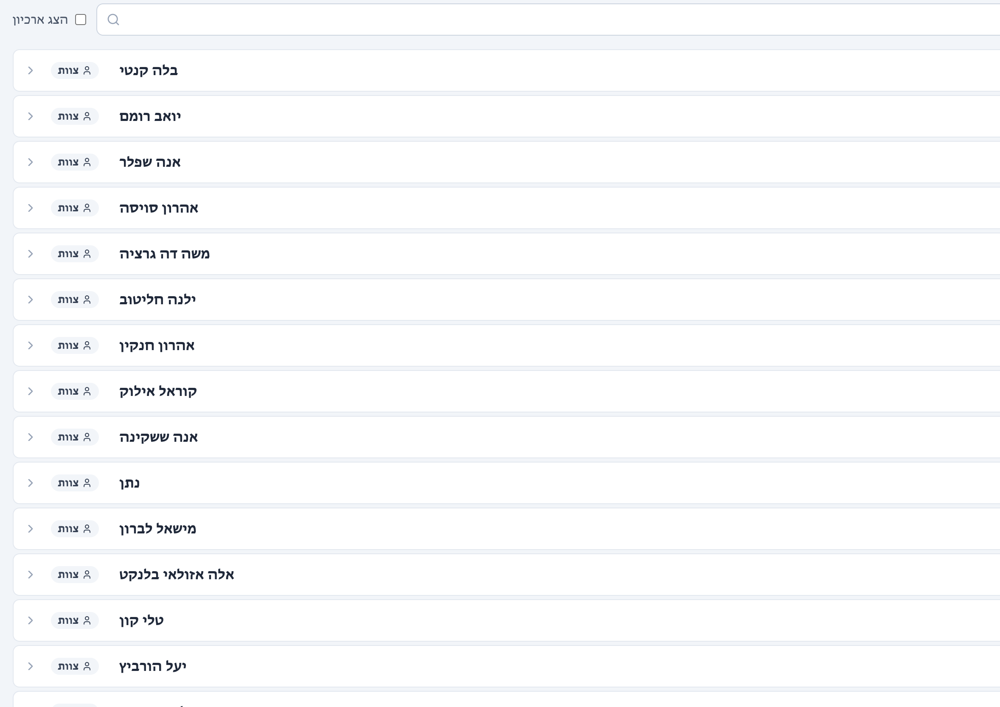
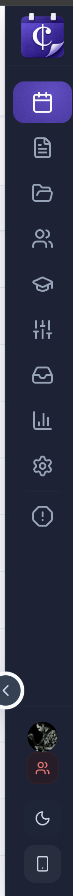
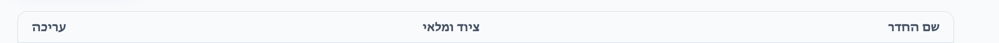
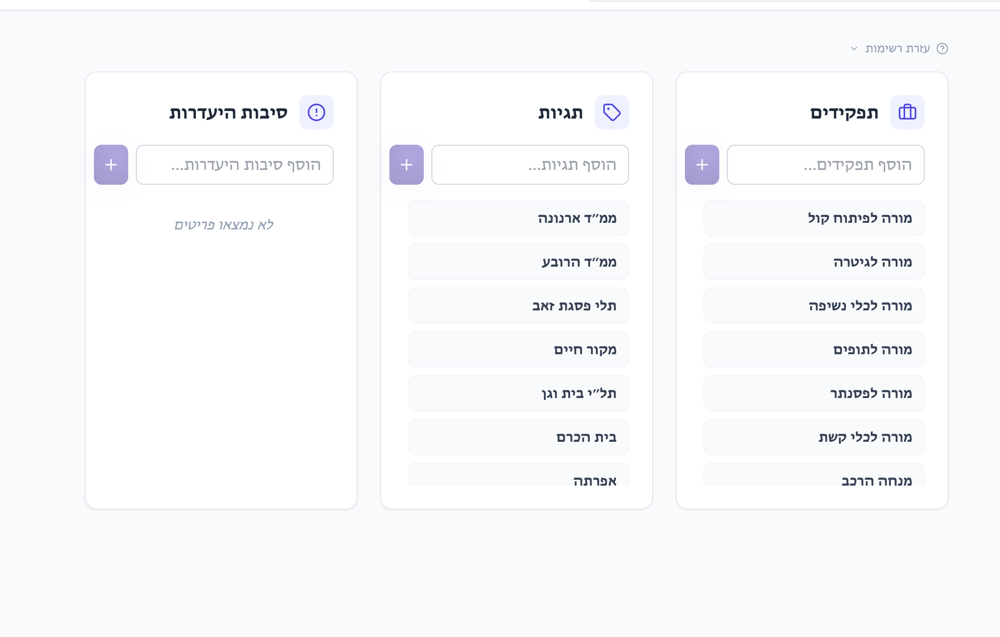
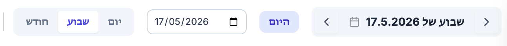
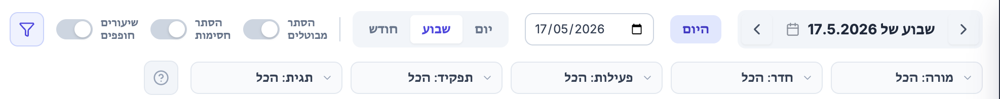

# QA Session — 2026-04-26 14:24

## [FIX] in RTL staff is still set to LTR alignment - fix this and make a pass of all tabs to see that everything is aligned RTL when RTL is selected in the language settings
- **What's broken:** in RTL staff is still set to LTR alignment - fix this and make a pass of all tabs to see that everything is aligned RTL when RTL is selected in the language settings
- **Screenshot:** 

## [FIX] minimized icons don not sit in the same horizontal coordinates as the expanded sidebar
- **What's broken:** minimized icons don not sit in the same horizontal coordinates as the expanded sidebar
- **Screenshot:** 

## [REVISION] in tabs that have lists such as these (for example teachers, rooms etc.) allow for an alphabetical order from top to bottom or the opposite
- **What's broken:** in tabs that have lists such as these (for example teachers, rooms etc.) allow for an alphabetical order from top to bottom or the opposite
- **Screenshot:** 

## [REVISION] align to center
- **What's broken:** align to center
- **Screenshot:** 

## [REVISION] reduce the jump to date view so that only the calendar icon is showing and indicates that it is clickable. 
remove the calendar icon next to "week of the..."
transfer the jump to date option to the end of the chain so that the options are "today, day, week, month,jump to date
- **What's broken:** reduce the jump to date view so that only the calendar icon is showing and indicates that it is clickable. 
remove the calendar icon next to "week of the..."
transfer the jump to date option to the end of the chain so that the options are "today, day, week, month,jump to date
- **Screenshot:** 

## [REVISION] embed the "canceled, blacked, and conflicting" into the expanded filter menu. place it at the begining of the chain
- **What's broken:** embed the "canceled, blacked, and conflicting" into the expanded filter menu. place it at the begining of the chain
- **Screenshot:** 
